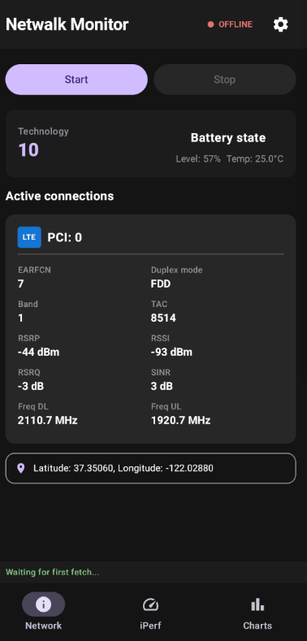
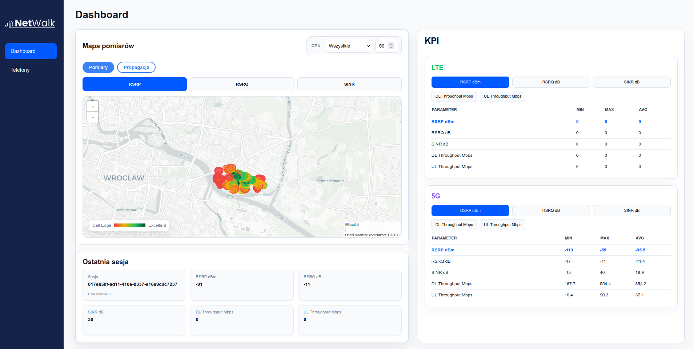

# NetWalk

Platform designed for LTE and 5G network performance testing and analysis.
Automates collection, storage and visualization of mobile network metrics
during walk-tests.

## Key features

- *Data Collection*: Real-time network parameters measuring (RSRP, RSRQ, SINR, CID, TAC, Band) and throughput testing (iperf3 TCP/UDP).
- *Geo-spatial and time-series Storage*: High-performance storage using TimescaleDB with PostGIS extensions for precise location tracking and robust retrieval.
- *Analytical Engine*: KPI calculation, multi-parameter filtering, and session management.
- *Visualization*: Interactive mapping with heatmaps and signal propagation maps.
- *REST API*: Easy integration for external data analysis tools.





## Usage

### Infrastructure

``` sh
cp ./.env.example ./.env    # crete env file from example, edit if nesesarry

docker compose up --build   # deploy full aplication
```

Web application will be available on port `8080`, via web-server,
ready to be hosted on network.

### Android Application

Install android application from releases, in settings provide:

- API address
- iperf3 address IP and port
- credentials (from `.env`)

> Note: then changing iperf3 test parameters (specifcally `-M`, `-I` and`-b`) pay attention to your network capabilities
> E.g. in standart 5G network TCP DF pacakges cannot be larger then 1500 bytes, including heasers.

## Load database snapshot (if nesesasrry)

``` sh
docker compose exec -T timescaledb \
    pg_restore -U $"POSTGRES_USER" --clean --if-exists -d $"POSTGRES_DB" < /path/to/file.bak
```

---

## Development

### General requirements

- [**just**](https://github.com/casey/just#installation)
    (or `uv tool install just`)
- [**pre-commit**](https://pre-commit.com/#install)
    (or `uv tool install pre-commit`)
- [**Docker CE + Compose**](https://docs.docker.com/engine/install/)

### Android Only

- [**Gradle**](https://gradle.org/install/)
    (or via [sdkman](https://sdkman.io/))
- [**Android SDK**](https://developer.android.com/studio#command-tools )
    (or via [sdkman](https://sdkman.io/))
